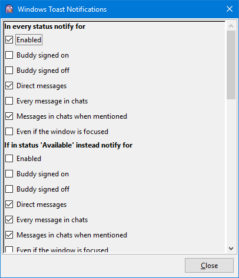
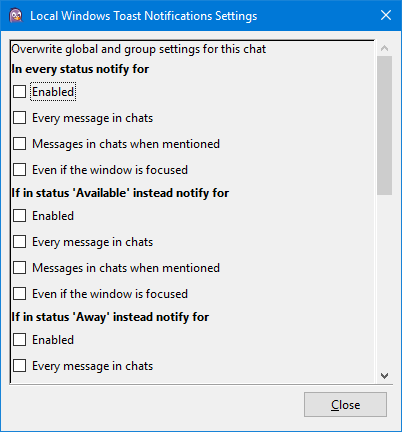

# PidginWinToastNotifications

Windows toast notification plugin for [Pidgin](https://pidgin.im/).

Shows notifications on message receive or buddy sign on / off in the standard Windows design.

Direct message from someone who has a profile picture:

Direct message from someone who has not a profile picture:

Chat message from someone who has not a profile picture:

A buddy who has not a profile picture signed on:

A buddy who has not a profile picture signed off:

This plugin uses Pidgin's standard C API so no other tools like Perl are required.

## Table of contents

* [Supported Pidgin versions](#supported-pidgin-versions)
* [Supported operating systems](#supported-operating-systems)
* [Installation](#installation)
* [Troubleshooting](#troubleshooting)
* [Configuration](#configuration)
* [Help and feature requests](#help-and-feature-requests)
* [Changelog](#changelog)
* [Architecture](#architecture)
* [How to build on Windows](#how-to-build-on-windows)

## Supported Pidgin versions

The plugin was developed and tested using the newest Pidgin 2 version 2.13.0.

For Pidgin version 2.12.0 there is an [alternate download](https://github.com/ChristianGalla/PidginWinToastNotifications/releases/download/v1.6.1/PidginWinToastNotifications.for.Pidgin.2.12.0.zip).

Older versions of Pidgin are currently not supported.

## Supported operating systems

The plugin was developed and tested using the newest Windows 10 version.

Other Windows 10 versions, Windows 8 and Windows 8.1 should also work, but this has not been tested.

To display the protocol, account and chat name in the toast notifications the Windows 10 Anniversary Update (also known as version 1607 or Redstone 1) or newer is required.

## Installation

1. Ensure to have the Microsoft Visual C++ 2015-2019 Redistributable (x86) installed or [download and install it from Microsoft](https://aka.ms/vs/16/release/vc_redist.x86.exe).
2. Download the dll files from the [newest release](https://github.com/ChristianGalla/PidginWinToastNotifications/releases/latest).
3. Copy the file PidginWinToastLib.dll to the installation directory of Pidgin. This is usually "C:\Program Files (x86)\Pidgin" on 64-bit versions of Windows or "C:\Program Files\Pidgin" on a 32-bit version.
4. Copy the file PidginWinToastNotifications.dll to the plugin directory of Pidgin. This is usually "C:\Program Files (x86)\Pidgin\plugins" on 64-bit versions of Windows or "C:\Program Files\Pidgin\plugins" on a 32-bit version.
5. Start Pidgin. Open the plugin window and enable "Windows Toast Notifications".

## Troubleshooting

If the plugin cannot be enabled, there should be an error message in the error search window available in the help menu of Pidgin.

If you experience a problem or have an idea for a new feature, [feel free to open an issue](https://github.com/ChristianGalla/PidginWinToastNotifications/issues).

### Known errors

* The initialization may fail if the current user is not permitted to edit the Pidgin shortcut in the Start menu.

  To be able to create Windows Toast Notifications, it is required to set a property on the Start menu shortcut of Pidgin or automatically create a new one. Please ensure the current user is permitted to do this.
  
* A notification for a received message is shown when you send the message from another device.

  The used protocol may incorrectly call Pidgin's message receive event. Please update your protocol plugin and if the error persists, contact the author of the protocol plugin to have a look into this.
  
* There is a duplicate task bar icon.

  The Toast notification plugin sets an Application User Model ID that is used to group program windows.
  
  If you have pinned Pidgin to the task bar before enabling the Toast notification plugin, unpin it and pin the current running Pidgin window.
  
  If you are using other Windows specific plugins, they may try to set another conflicting app id. Please try to identify incompatible Plugins by selective enabling or disabling. If you have found an incompatible plugin, try to update it to the newest version before creating an issue.

## Configuration

It can be configured if notifications should be shown for direct messages, every message in chats, only for messages in chats when mentioned or only if the conversation window is not focused.

It is also possible to configure if a notification should be shown when a buddy signed on or off.

This configuration can be overwritten per status (Available, Away, Do not disturb, Extended away or Invisible).

Global configuration:

It is also possible to overwrite the global settings for each group, chat and buddy.

Configuration for a group:

Configuration for a chat:

Configuration for a buddy:

The global configuration can be accessed via the default plugin configuration page (In Buddy List: Tools / Plugins / Windows Toast Notifications).

The group settings can be opened from the context menu of a group in the Buddy List.

The local settings can be opened from the conversation menu underneath *More* or from the context menu of a buddy or chat in the Buddy List:

## Changelog

All changes between versions are documented in the file [CHANGELOG.md](./CHANGELOG.md).

## Architecture

This Plugin consists of the two dll files PidginWinToastNotifications.dll and PidginWinToastLib.dll.

PidginWinToastNotifications.dll is loaded from Pidgin as plugin. It is written in ANSI C and it provides necessary plugin information. It registers callback functions in Pidgin's message API and relays received messages to PidginWinToastLib.dll.

PidginWinToastLib.dll is written in C++ and calls Windows's toast notification API to display the toast notifications. For that it uses [WinToast](https://github.com/mohabouje/WinToast) as library.

## How to build on Windows

### PidginWinToastNotifications.dll

This file is build using the GNU Compiler Collection (GCC).

1. Follow the [official instructions of the Pidgin wiki to set up your build environment](https://developer.pidgin.im/wiki/BuildingWinPidgin#Setupyourbuildenvironment). For this I recommend [pidgin-windev](https://github.com/renatosilva/pidgin-windev).
2. Copy the files Plugin/PidginWinToastNotifications.h and Plugin/PidginWinToastNotifications.c into the subfolder pidgin\plugins inside of your Pidgin development directory.
3. Inside a Cygwin Terminal navigate to pidgin\plugins inside of your Pidgin development directory.
4. Run the Command: *make -f Makefile.mingw PidginWinToastNotifications.dll*

Now the file PidginWinToastNotifications.dll should be in the same folder.

### PidginWinToastLib.dll

This file is build using Visual Studio 2017.

Open the Solution lib/PidginWinToastLib.sln in Visual Studio 2017. Right click on the Project and hit Build.

Now the file PidginWinToastLib.dll should be in the Release folder of your Solution.
